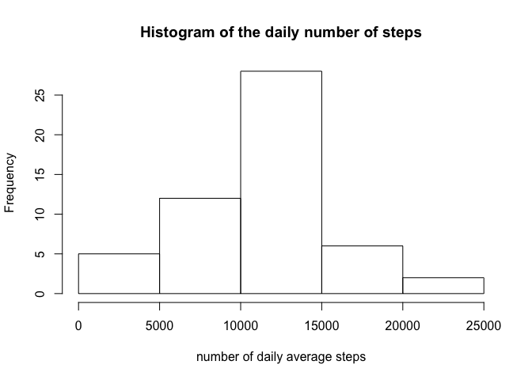
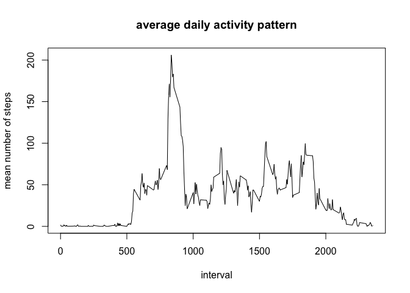
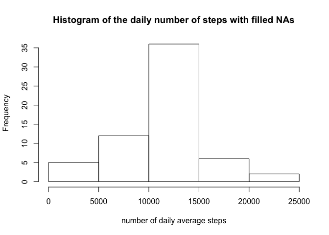
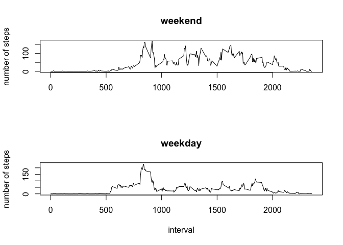

# Reproducible Research: Peer Assessment 1


## Loading and preprocessing the data
Unzip and read the data

```r
data <- read.csv(unz(description="activity.zip",filename="activity.csv"), na.strings="NA")
```
Convert the date values from factor to date

```r
data$date <- as.Date(data$date)
```

## What is mean total number of steps taken per day?
First make unique dates

```r
dates <- unique(data$date)
```
Create a data frame for daily sums of steps

```r
res <- data.frame(date      = dates, 
                  sumsteps  = numeric(length(dates)))
```
Set the column for sums of steps to NA to avoid confusion with the automatically filled 0

```r
res$sumsteps = NA
```
Calculate the sum of steps per day

```r
for (i in dates) {
    res$sumsteps[res$date==i] <- sum(data$steps[data$date==i])
    }
```
Create a histogram for the daily sums of steps

```r
hist(res$sumsteps, xlab = "number of daily average steps", main = "Histogram of the daily number of steps")
```

 

Calculate the total mean and median of steps

```r
stepmean   <- mean(res$sumsteps, na.rm=TRUE)
stepmedian <- median(res$sumsteps, na.rm=TRUE)
```

**The mean total number of steps taken per day is 1.0766189\times 10^{4} and the median of the total number of steps taken per day is 10765.**  


## What is the average daily activity pattern?
First make unique intervals

```r
interval <- unique(data$interval)
```
Create a data frame for interval means

```r
res2 <- data.frame(interval  = interval, 
                   meanstep  = numeric(length(interval)))
```
Set the column for the mean of steps to NA to avoid confusion with the automatically filled 0

```r
res2$meanstep = NA
```
Calculate the mean of steps per interval

```r
for (i in interval) {
    res2$meanstep[res2$interval==i] <- mean(data$steps[data$interval==i], na.rm=TRUE)
    }
```
Plot of the average daily activity pattern:

```r
plot(res2$interval, res2$meanstep, type = "l", xlab = "interval", ylab = "mean number of steps", main = "average daily activity pattern")
```

 

Find the interval with maximum number of steps

```r
maxsteps    <- max(res2$meanstep, na.rm = TRUE)
maxinterval <- res2$interval[res2$meanstep==maxsteps]
```
**The 5-minute interval 835 contains the maximum number of steps (206.1698113) averaged across all days.**

## Imputing missing values
Find the total number of missing values in the dataset

```r
countNA <- sum(is.na(data$steps))
```
**The total number of missing values in the dataset is 2304.**

The missing values will be filled with the interval mean.

Create a new data frame for the filled data.

```r
res3 <- data 
```
Substitute NAs with the mean of the respective intervals.

```r
for (i in 1:length(res3$date)){
    if(is.na(res3$steps[i])){
        res3$steps[i] <- res2$meanstep[res2$interval==res3$interval[i]]
    }
}
```
Create a data frame for daily sums of steps

```r
res4 <- data.frame(date   = dates, 
                   steps  = numeric(length(dates)))
```
Calculate the sum of steps per day

```r
for (i in dates) {
    res4$steps[res4$date==i] <- sum(res3$steps[res3$date==i])
    }
```
Create a histogram for the total number of steps taken each day

```r
hist(res4$steps, xlab = "number of daily average steps", main = "Histogram of the daily number of steps with filled NAs")
```

 

Calculate the total mean and median of steps

```r
stepmeanFilled   <- mean(res4$steps, na.rm=TRUE)
stepmedianFilled <- median(res4$steps, na.rm=TRUE)
```
**The mean total number of steps taken per day is 1.0766189\times 10^{4} and the median of the total number of steps taken per day is 1.0766189\times 10^{4}. Only small differences occur between the original and NA-filled data anlysis.**

## Are there differences in activity patterns between weekdays and weekends?
Getting names of weekdays 

```r
res3$day <- weekdays(res3$date)
```
Determine, if it is a weekday or weekend (since the system language is not set to english, German names are used; Samstag = Saturday, Sonntag = Sunday)

```r
for (i in 1:length(res3$date)){
    if(res3$day[i]== "Samstag" || res3$day[i]== "Sonntag" ){
        res3$daytype[i] <- as.character("weekend")
    }
    else{
        res3$daytype[i] <- as.character("weekday")
    }
}
```
Convert character to factor 

```r
res3$daytype<-as.factor(res3$daytype)
```
Make unique intervals

```r
interval <- unique(res3$interval)
```
Create a data frame for the mean of the number of steps for weekdays and weelends, respectively.

```r
res5 <- data.frame(interval         = interval, 
                   meanstepweekend  = numeric(length(interval)),
                   meanstepweekday  = numeric(length(interval)))
```
Calculate the mean number of steps per interval of weekdays and weekends, respectively.

```r
allweekends <-res3[res3$daytype == "weekend",]

for (i in interval) {
    res5$meanstepweekend[res5$interval==i] <- mean(allweekends$steps[allweekends$interval == i], na.rm=TRUE)
    }

allweekday <-res3[res3$daytype == "weekday",]

for (i in interval) {
    res5$meanstepweekday[res5$interval==i] <- mean(allweekday$steps[allweekday$interval == i], na.rm=TRUE)
    }
```
Create the panel plot

```r
par(mfrow=c(2,1))
plot(res5$interval, res5$meanstepweekend, type = "l", xlab = "", ylab="number of steps", main ="weekend")
plot(res5$interval, res5$meanstepweekday, type = "l", xlab = "interval", ylab="number of steps", main ="weekday")
```

 
